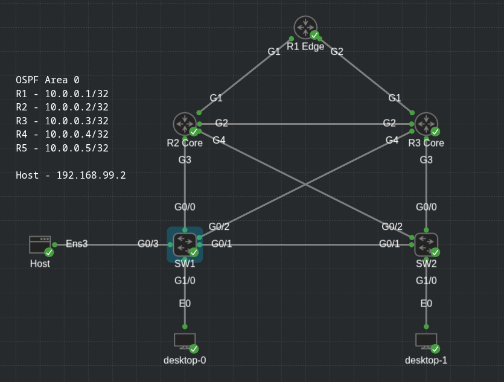

# Config generator with Ansible + Jinja

Automate device configuration, Reduce manual effort and improve consistency.

```
host_vars/<host>.yml  +  templates/base.j2
                    │
        ┌───────────┴───────────┐
        │                       │
    render.yml              push.yml
        │                       │
        ▼                       ▼
  configs/<host>.cfg      configs/<host>.cfg ──► device
   (just a file)            (same file, then SSH'd on)
```

## Description

Automate the configuration of network devices using Ansible + Jinja templates.
Tested using CML labs 2.10.


## Installation
```bash
git clone https://github.com/Klimpsch/Ansible-Jinja-config-gen
cd Ansible-Jinja-config-gen
python -m venv venv
source venv/bin/activate      
pip install -r requirements.txt
```

## Run it

```bash
ansible-playbook render.yml
```

Inventory is picked up automatically via `ansible.cfg`.
`configs/R1.cfg`, `R2.cfg`, `SW1.cfg`, `SW2.cfg`.


## What each file does

| File | Role |
|------|------|
| `inventory.ini` | lists the devices (R1, R2, R3, SW1, SW2) and groups them 
| `host_vars/<host>.yml` | per-device variables, auto-loaded by hostname 
| `templates/base.j2` | the Jinja template (almost identical) 
| `render.yml` | the playbook that renders each host 
| `push.yml` | the playbook that pushes config to each host
| `ansible.cfg` | project settings (points at the inventory) 

## Topology

